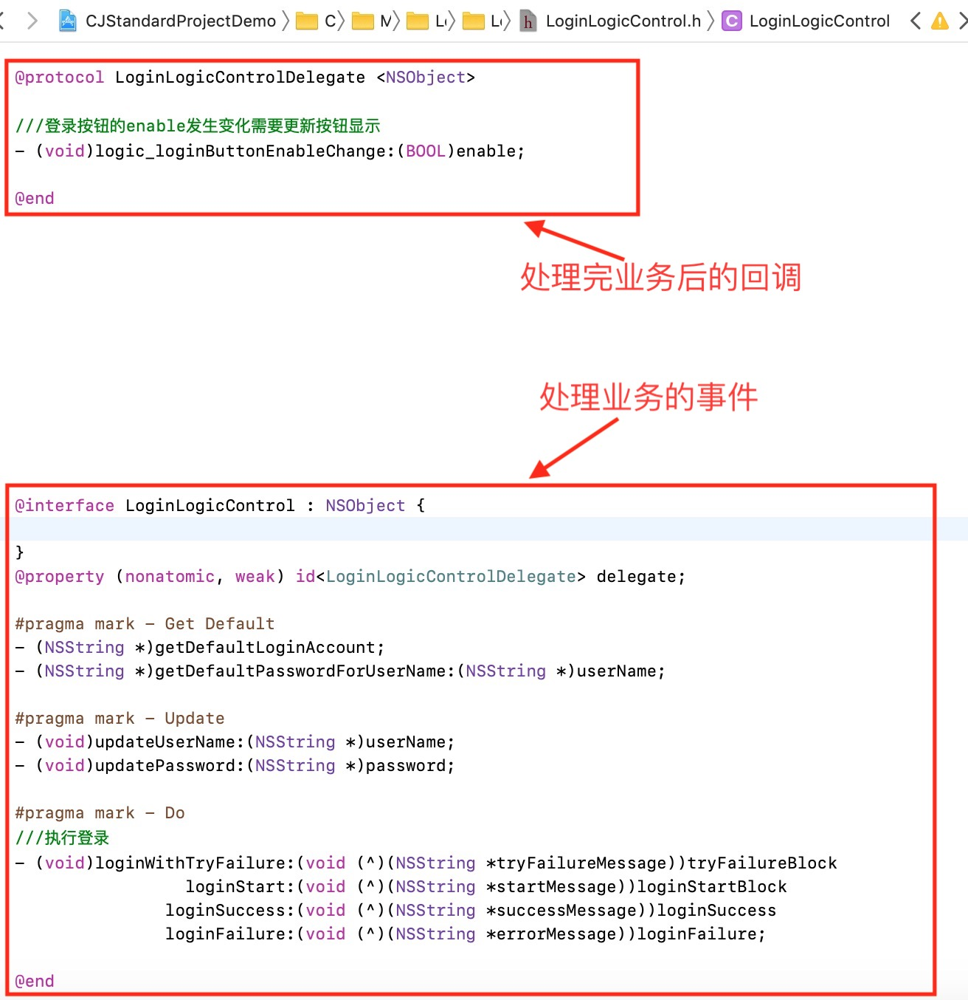
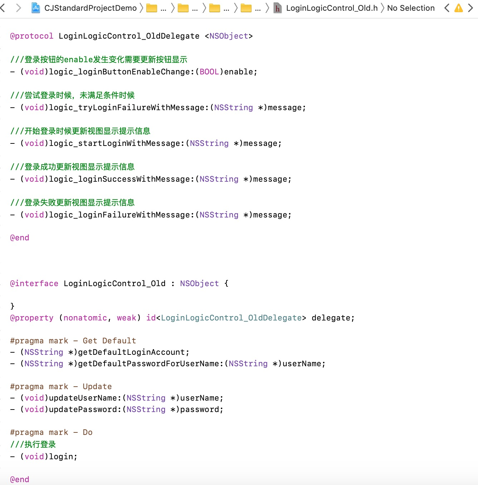
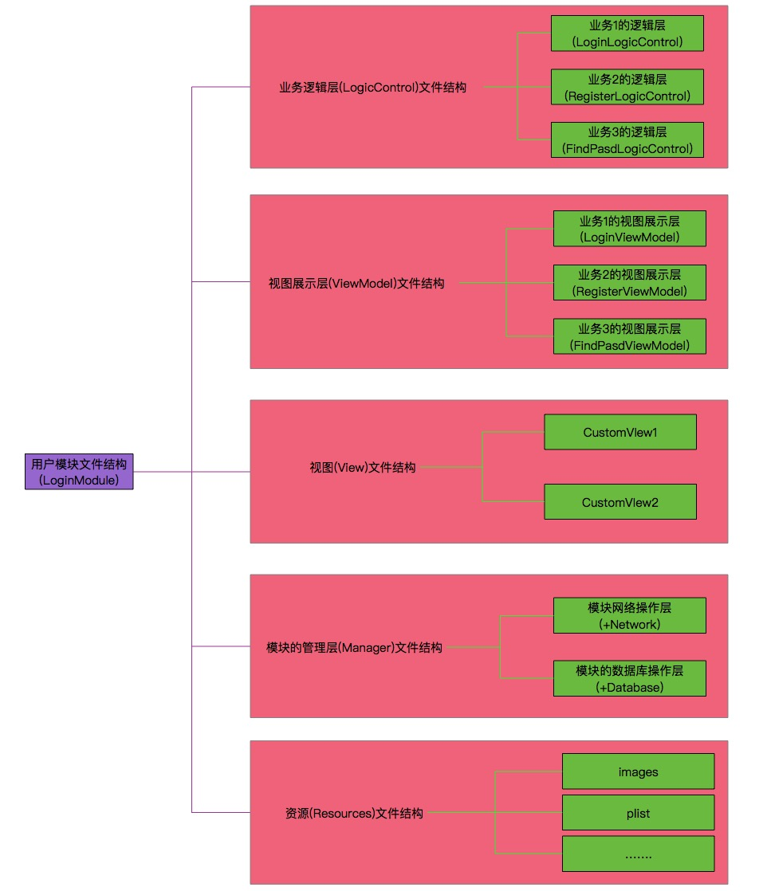
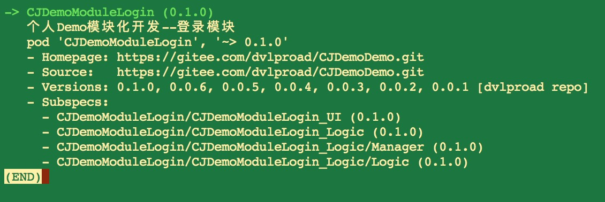

# CJStandardProject
架构Demo:展示规范开发的示例

实现清晰，目的明确的层次划分，并能在后续快速接入使用组件化开发。


## 前言
架构是为了良好的处理需求。而架构的理解设计，最后还是得根据业务、结合设想、实际需求来处理。

一直在想怎么描述一个架构的问题。思来想去，后面还是放弃了由面到点的描述方式，而采用由点到面的叙述。因为框架是站在业务上，站在点上，没有最好的，只有最合适的。

### 介绍/描述顺序
所谓点：即每个控制器(UIViewController)应该怎么写？各种设计模式。。。
所谓线：即各个控制器怎么交互？路由。。。。
所谓面：即怎么整体管理这些？模块化。。。

## 一、每个控制器(UIViewController)应该怎么写
首先**我们都知道每个UIViewController有业务和视图。所以，下面将由此作为切入点，分析如何书写UIViewController。**

好了，既然每个UIViewController有业务和视图，那么我们就自然的将业务逻辑和视图展示分开处理，做到完全解耦吧。怎么做呢？

**在接下去讲之前，我们约定处理UIViewController业务逻辑的叫做LogicControl类，处理UIViewController视图展示的叫做ViewControl类**(不用着急，不用着急，不用着急，这里会从这边慢慢讲到你们熟悉的ViewModel)。


#### 1、LogicControl
##### ①、处理的事情：
> UIViewController的业务逻辑（纯业务逻辑，绝对不会有任何视图控件）

##### ②、常见的事情举例：
> ①获取初始值、
> ②更新值、
> ③事件处理(如请求网络等)、
> ④以及提供事件的回调(提供方式由block和delegate，至于提供方式的选择后续会在规范中讲到)。

##### ③、类代码示例(以登录的业务逻辑`LoginLogicControl.h`举例)：

代码如下：

```objective-c
@protocol LoginLogicControlDelegate <NSObject>

/// userName 的有效性发生变化
- (void)vm_checkUserNameWithValid:(BOOL)valid;

/// password 的有效性发生变化
- (void)vm_checkPasswordWithValid:(BOOL)valid;

/// 登录按钮 的有效性发生变化
- (void)vm_checkLoginWithValid:(BOOL)valid;

@end


@interface LoginLogicControl : NSObject {
    
}
@property (nonatomic, weak) id<LoginLogicControlDelegate> delegate;

#pragma mark - Get Default
- (NSString *)getDefaultLoginAccount;
- (NSString *)getDefaultPasswordForUserName:(NSString *)userName;

#pragma mark - Update
- (void)updateUserName:(NSString *)userName;
- (void)updatePassword:(NSString *)password;

#pragma mark - Do
///执行登录
- (void)loginWithTryFailure:(void (^)(NSString *tryFailureMessage))tryFailureBlock
                 loginStart:(void (^)(NSString *startMessage))loginStartBlock
               loginSuccess:(void (^)(NSString *successMessage))loginSuccess
               loginFailure:(void (^)(NSString *errorMessage))loginFailure;

@end
```

下面是一张上面代码的截图(可略过)，其中事件处理及回调如下图所示：
> 

##### ④、业务需求更改怎么办？
但业务需求更改时候，不用去关心UIViewController.m里面的东西，只需要对控制UIViewController业务的LogicControl进行修改即可。(这里不讨论界面变化)

##### ⑤、是否可复用？
看你对复用的理解了。

举例：
> 司机端的登录已经做完，现在需要做乘客端的登录，他们的业务逻辑一样，即都是获取初始值、更新值、登录事件处理等。


说完了UIViewController独立出来的`业务逻辑处理LogicControl`后，下面我们说说另一部分UIViewController的`视图展示处理ViewControl`。

#### 2、ViewControl
##### ①、处理的事情：
> UIViewController的视图展示（纯视图展示处理，不会有任何业务逻辑）

##### ②、常见的事情举例：
> ①更新视图显示值、
> ②以及提供操作视图后的视图变化回调(提供方式统一为delegate)。

##### ③、类代码示例(以登录的业务逻辑`LoginViewControl.h`举例)：

代码如下：

```objective-c
@protocol LoginViewControlDelegate <NSObject>

- (void)view_userNameTextFieldChange:(NSString *)userName;  /**< 用户名文本框内容改变了 */
- (void)view_passwordTextFieldChange:(NSString *)password;  /**< 密码文本框内容改变了 */

- (void)view_loginButtonAction;
- (void)view_registerButtonAction;
- (void)view_findPasswordButtonAction;

@end


@interface LoginViewControl : NSObject <UITextFieldDelegate> {
    
}
@property (nonatomic, weak) id<LoginViewControlDelegate> delegate;

@property (nonatomic, strong) UIView *view;
//@property (nonatomic, strong) UIImageView *portraitImageView;   /**< 头像 */
@property (nonatomic, strong) CJTextField *userNameTextField;   /**< 账号(记得关掉自动纠错) */
@property (nonatomic, strong) CJTextField *passwordTextField;   /**< 密码 */
@property (nonatomic, strong) UIButton *loginButton;            /**< 登录按钮 */
@property (nonatomic, strong) UIButton *findPasswordButton;     /**< 找回密码按钮 */
@property (nonatomic, strong) UIButton *registerButton;         /**< 注册按钮 */
@property (nonatomic, strong) MBProgressHUD *loginStateHUD;     /**< 进展状态HUD */


#pragma mark - UpdateView
///更新文本框的值
- (void)updateUserNameTextField:(NSString *)userName;
///更新文本框的值
- (void)updatePasswordTextField:(NSString *)password;
///更新登录按钮的点击状态
- (void)updateLoginButtonEnable:(BOOL)enable;
///开始视图的editing
- (void)startEndEditing;
///结束视图的editing
- (void)stopEndEditing;

///"尝试登录失败(未满足条件)时候"，更新视图
- (void)tryLoginFailureWithMessage:(NSString *)message;

///"开始登录时候"更新视图(如显示提示信息)
- (void)startLoginWithMessage:(NSString *)message;

///“登录成功进入/回到主页时候"更新视图
- (void)loginSuccessWithMessage:(NSString *)message isBack:(BOOL)isBack;

///"登录失败时候"更新视图
- (void)loginFailureWithMessage:(NSString *)message;

@end
```


#### 3、界面跳转
因为界面跳转既属于业务，也属于视图、即不属于业务，也不属于视图，所以界面的跳转不放到上面的业务处理类LogicControl中，也不放到上面的视图处理类ViewControl中，而是直接放在UIViewController.m中。这部分的优化后续会再说明。

## 二、优化 LogicControl + ViewControl(配送端今后规范底线)
再接下去详细讲更多细节和更大模块前，我们先对 `LogicControl + ViewControl`这一部分进行优化。这个也是**配送端今后规范底线**。

#### 1、几个名词
* LV：LogicContol + ViewControl 
> 将UIViewController的业务(Logic)和视图(View)完全独立到不同类中处理，其余的通过各自的回调到在UIViewController处理。

* LM：LogicModel ，即LV结构中的Logic
> 改善于LV结构，不独立出ViewControl，UIViewController的视图处理仍在ViewController中。

* VM：ViewModel
> 改善于LM结构，将LM改名为VM，同时加入RAC、KVO等绑定功能。

#### 2、命名：logicControl/viewLogic/ViewModel(可商榷)

##### 3、回调(block与delegate上的选择)：
回调使用原则：由于业务回调经常有多个，为达到统一，而非有时候在初始化之后查看回调，有时候在回调区块中查看，所以回调禁止通过为业务模型添加block属性实现，统一通过delegate实现。

附初始化后的回调，形如：

```
self.viewLogic = [[LoginLogicControl alloc] init];
self.viewLogic.loginButtonEnableChange = ^(BOOL enable) {
	return NO;
}
```

回调区块中查看，形如：

```
 #pragma mark - LoginLogicControlDelegate
 
 ///登录按钮的enable发生变化需要更新按钮显示
- (void)vm_checkLoginWithValid:(BOOL)enable {

}
```

故，实际代码中的做法，统一如下：

> // 提倡

```objective-c
@protocol LoginLogicControlDelegate <NSObject>

/// userName 的有效性发生变化
- (void)vm_checkUserNameWithValid:(BOOL)valid;

/// password 的有效性发生变化
- (void)vm_checkPasswordWithValid:(BOOL)valid;

/// 登录按钮 的有效性发生变化
- (void)vm_checkLoginWithValid:(BOOL)valid;

///尝试登录时候，未满足条件时候
- (void)vm_tryLoginFailureWithMessage:(NSString *)message;

///开始登录时候更新视图显示提示信息
- (void)vm_startLoginWithMessage:(NSString *)message;

@end


@interface LoginLogicControl : NSObject {

}
@property (nonatomic, weak) id<LoginLogicControlDelegate> delegate;

@end
```

> // 禁止

```objective-c
@interface LoginLogicControl : NSObject {

}
@property (nonatomic, copy) void (^loginButtonEnableChange)(BOOL enable);

@end

```


##### 3、特殊回调，方法中
有时候，执行方法的时候就会有回调。直接使用block，不去绕delegate的弯！

实际代码中，如下：

> // 提倡

```objective-c
@interface LoginLogicControl : NSObject {

}

#pragma mark - Do
///执行登录
- (void)loginWithTryFailure:(void (^)(NSString *tryFailureMessage))tryFailureBlock
				loginStart:(void (^)(NSString *startMessage))loginStartBlock
				loginSuccess:(void (^)(NSString *successMessage))loginSuccess
				loginFailure:(void (^)(NSString *errorMessage))loginFailure;

@end
```

> // 禁止

```objective-c
@protocol LoginLogicControlDelegate <NSObject>

///尝试登录时候，未满足条件时候
- (void)vm_tryLoginFailureWithMessage:(NSString *)message;

///开始登录时候更新视图显示提示信息
- (void)vm_startLoginWithMessage:(NSString *)message;

///登录成功更新视图显示提示信息
- (void)vm_loginSuccessWithMessage:(NSString *)message;

///登录失败更新视图显示提示信息
- (void)vm_loginFailureWithMessage:(NSString *)message;

@end


@interface LoginLogicControl : NSObject {
    
}
@property (nonatomic, weak) id<LoginLogicControlDelegate> delegate;

#pragma mark - Do
///执行登录
- (void)login;

@end

```

#### 4、默认数据与绑定

```objective-c
	//显示上次登录的账号
    NSString *userName = [self.logicControl getDefaultLoginAccount];
    NSString *password = [self.logicControl getDefaultPasswordForUserName:userName];
    self.userNameTextField.text = userName;
    self.passwordTextField.text = password;
    
    [self.logicControl updateUserName:userName];
    [self.logicControl updatePassword:password];
```

#### 5、业务逻辑LogicControl改造前后区别（以`LoginLogicControl.h`举例）
改造前的`LoginDelegateViewModel.h`

```objective-c
@protocol LoginDelegateViewModelDelegate <NSObject>

/// userName 的有效性发生变化
- (void)vm_checkUserNameWithValid:(BOOL)valid;

/// password 的有效性发生变化
- (void)vm_checkPasswordWithValid:(BOOL)valid;

/// 登录按钮 的有效性发生变化
- (void)vm_checkLoginWithValid:(BOOL)valid;

///尝试登录时候，未满足条件时候
- (void)vm_tryLoginFailureWithMessage:(NSString *)message;

///开始登录时候更新视图显示提示信息
- (void)vm_startLoginWithMessage:(NSString *)message;

///登录成功更新视图显示提示信息
- (void)vm_loginSuccessWithMessage:(NSString *)message;

///登录失败更新视图显示提示信息
- (void)vm_loginFailureWithMessage:(NSString *)message;

@end


@interface LoginDelegateViewModel : NSObject {
    
}
@property (nonatomic, weak) id<LoginDelegateViewModelDelegate> delegate;

#pragma mark - Get Default
- (NSString *)getDefaultLoginAccount;
- (NSString *)getDefaultPasswordForUserName:(NSString *)userName;

#pragma mark - Update
- (void)updateUserName:(NSString *)userName;
- (void)updatePassword:(NSString *)password;

#pragma mark - Do
///执行登录
- (void)login;

@end
```

改造后的`LoginLogicControl`

```objective-c
@protocol LoginLogicControlDelegate <NSObject>

/// userName 的有效性发生变化
- (void)vm_checkUserNameWithValid:(BOOL)valid;

/// password 的有效性发生变化
- (void)vm_checkPasswordWithValid:(BOOL)valid;

/// 登录按钮 的有效性发生变化
- (void)vm_checkLoginWithValid:(BOOL)valid;

@end


@interface LoginLogicControl : NSObject {
    
}
@property (nonatomic, weak) id<LoginLogicControlDelegate> delegate;

#pragma mark - Get Default
- (NSString *)getDefaultLoginAccount;
- (NSString *)getDefaultPasswordForUserName:(NSString *)userName;

#pragma mark - Update
- (void)updateUserName:(NSString *)userName;
- (void)updatePassword:(NSString *)password;

#pragma mark - Do
///执行登录
- (void)loginWithTryFailure:(void (^)(NSString *tryFailureMessage))tryFailureBlock
                 loginStart:(void (^)(NSString *startMessage))loginStartBlock
               loginSuccess:(void (^)(NSString *successMessage))loginSuccess
               loginFailure:(void (^)(NSString *errorMessage))loginFailure;

@end
```

不想看代码的，我就截个图吧，

> **LoginLoginControl_Old.h(登录的业务逻辑)**
> 
> 
> 
> **LoginLoginControl_New.h(登录的业务逻辑)**
> 
> 

再给截个图直观比较下吧 
> **LoginLoginControl_OldAndNew.h(登录的业务逻辑)**
> 
> 

## 三、Manager
来不及写。。。。。

   #import "CJDemoServiceUserManager+Network.h"

```objective-c
@interface CJDemoServiceUserManager (Network)

#pragma mark - Network
///登录
- (void)requestLoginWithAccount:(NSString *)account
                       password:(NSString *)password
                        success:(void (^)(NSDictionary *responseDict))success
                        failure:(void (^)(NSError *error))failure;

///注册
- (void)requestRegisterWithAccount:(NSString *)account
                          password:(NSString *)password
                             email:(NSString *)email
                           success:(void (^)(NSDictionary *responseDict))success
                           failure:(void (^)(NSError *error))failure;


///通过了邮件请求更新密码
- (void)requestNewPasswordWithString:(NSString *)string
                             success:(void (^)(NSDictionary *responseDict))success
                             failure:(void (^)(NSError *error))failure;

///退出
- (void)requestLogoutUid:(NSString *)uid
                 success:(void (^)(NSDictionary *responseDict))success
                 failure:(void (^)(NSError *error))failure;

@end
```


 #import "CJDemoServiceUserManager+UserTable.h"

```objective-c
@interface CJDemoServiceUserManager (UserTable)

- (NSString *)sqlForCreateTable;

- (BOOL)insertAccountInfo:(DemoUser *)info;
- (BOOL)removeAccountInfoWhereName:(NSString *)name;

//update
- (BOOL)updateAccountInfoExceptUID:(DemoUser *)info whereUID:(NSString *)uid;
- (BOOL)updateAccountInfoImagePath:(NSString *)imagePath whereUID:(NSString *)uid;
- (BOOL)updateAccountInfoImageUrl:(NSString *)imageUrl whereUID:(NSString *)uid;
- (BOOL)updateAccountInfoExecTypeL:(NSString *)execTypeL whereUID:(NSString *)uid;

//query
- (DemoUser *)selectAccountInfoWhereUID:(NSString *)uid;
- (UIImage *)selectAccountImageWhereUid:(NSString *)uid;


@end
```


## Screenshot
#### 1、层次图
> 

#### 2、模块文件结构图
模块文件结构图示例
> 

模块文件结构图示例
> 

#### 3、pod结构
pod结构
> 

#### 4、Demo
Demo请查看[CJStandardProjectDemo](./CJStandardProjectDemo)


## 版本介绍/更新记录
* 2018-08-29

> 1. 添加展示规范开发的初始示例CJStandardProjectDemo；

## 结束语
今天，先到这，有很多东西后面再完善补充。
